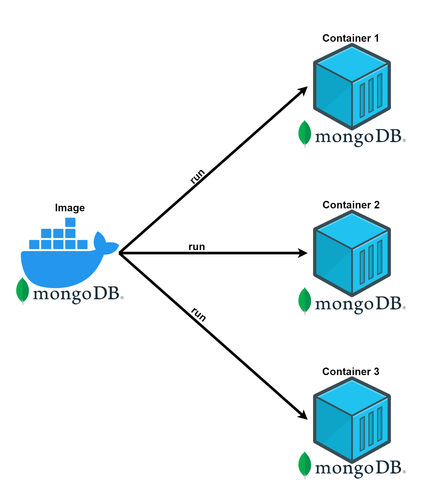
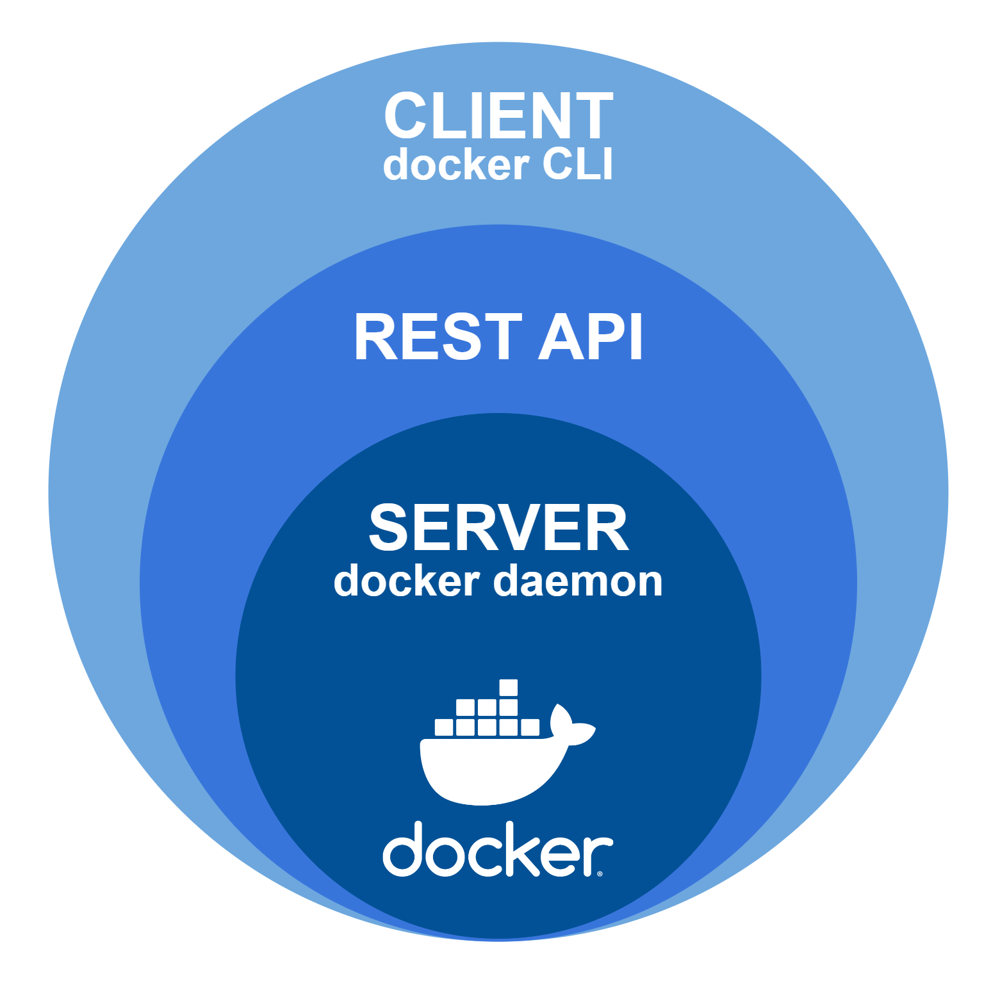

# ¿Qué es Docker?
Docker es una herramienta de [virtualización de contenedores](./Glosario.md#G-vc) que permite a los desarrolladores crear, desplegar y ejecutar aplicaciones de manera eficiente y portátil utilizando imágenes y contenedores.

- **¿Qué es un contenedor?**
Es una unidad de software que contiene todo lo necesario para ejecutar una aplicación, incluyendo el código, las dependencias y la configuración del sistema. Los contenedores se crean a partir de imágenes, que son archivos que contienen una configuración de software específica y se pueden utilizar para crear y ejecutar contenedores de manera consistente.

- **¿Qué es una imagen?**
Una imagen Docker es como un archivo que contiene todos los elementos necesarios para que una aplicación pueda funcionar correctamente en un contenedor Docker. Las imágenes Docker se almacenan en un registro público o privado y se pueden descargar y usar por otros desarrolladores.

Cuando queremos ejecutar la imagen lo que hacemos es instanciarla de manera particular en lo que ya sería el contenedor. Podremos crear tantas instancias de una imagen como queramos y en los entornos que queramos.

Para poder instanciar una imagen simplemente tenemos que utilizar la utilidad docker ejecutando un comando:

``docker run --name mongodb-test -p 27017:27017 -d mongo:6.0``

    

<!-- -->

# Arquitectura de Docker
La arquitectura de Docker es el conjunto de componentes y procesos que se utilizan para crear y ejecutar aplicaciones en contenedores. Se compone de los siguientes elementos principales:
- **Docker CLI (Client)**
Es la interfaz de lpinea de comando que utilziamos para interectuar con Docker. Permite ejecutar comando para construir, ejecutar y gestionar contenedores, imágenes y redes y volúmenes. El cliente se comunica con el servidor Docker Daemon a través de la API REST.

- **REST API**
Es una interfaz web que expone los servicios del servidor Docker Daemon, permitiendo que el cliente Docker CLI y otras herramientas interectúen con Docker. La API REST es la forma en que el cliente se comunica con el servidor, y permite enviar solicitudes para crear, iniciar, detener y eliminar contenedores, imágenes y otros recursos de Docker.

- **Docker Daemon (Server)**
Es el componente principal de Docker que gestiona los contenedores, las imágenes, las redes y los volúmenes. El servidor Docker Daemon se ejecuta en el sistema operativo anfitrión y se comunica con el cliente Docker CLI y otras herramientas a través de la API REST. Además, Docker Daemon utiliza el kernel del siste,ma operativo anfitrión para crear y gestionar los contenedores de Docker de forma aislada.

    

